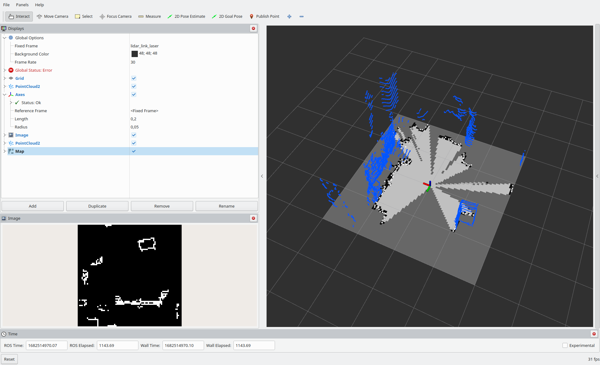

#### Problem description
A robot during its motion scans the area. To prevent collision it stops in front of an obstacle. 
Unfortunately, there are situations when floor points are considered as obstacles (false positive obstacle detection), and robots stops. 
So there is a fundamental need to filter these points out of the point cloud.

`ros2 run lidar2occupancy lidar2occupancy`

#### Result

#### Performed steps
1. Floor/ground detection, segmentation on point cloud
2. Scan orientation parallel to the ground
3. Floor points filtering
4. Robot Region of Interest cropping
5. Points discretization, projection to plane
6. Point Cloud transformation to Laser Scan
7. Occupancy Grid generation
